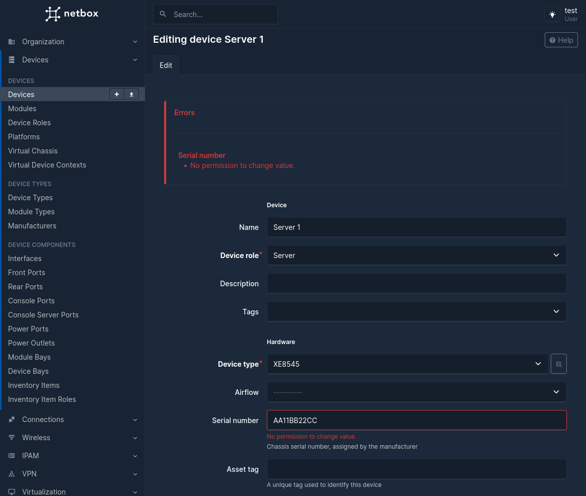
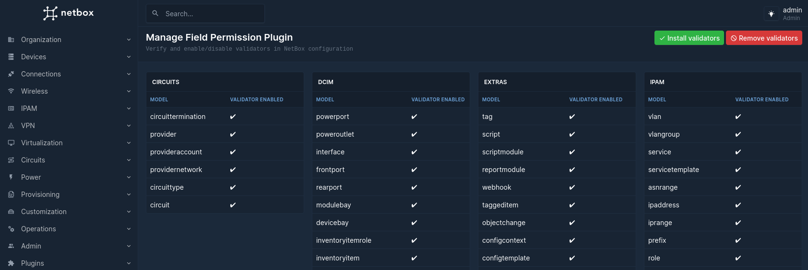

# netbox-field-permissions

Limit the ability for user/groups to change certain fields on NetBox objects.

By default, NetBox only allows you to restrict access an individual object, with this plugin you can restrict access on a field of an object.

A common use case for this is compliance where certain information is not allowed to be altered or simply prevent accidental changes.
## Compatibility

| NetBox Version | Plugin Version |
|----------------|----------------|
| 4.0            | 0.1.X          |

## Installing

For adding to a NetBox Docker setup see
[the general instructions for using netbox-docker with plugins](https://github.com/netbox-community/netbox-docker/wiki/Using-Netbox-Plugins).

### Install

```bash
pip install netbox-field-permissions
```

or by adding to your `local_requirements.txt` or `plugin_requirements.txt` (netbox-docker):

```bash
netbox-field-permissions
```

### Development Install

If you would like to install a version not yet published to pypi.

```bash
pip install git+https://github.com/TheDJVG/netbox-field-permissions
```

or by adding to your `local_requirements.txt` or `plugin_requirements.txt` (netbox-docker):

```bash
git+https://github.com/TheDJVG/netbox-field-permissions
```

### NetBox Configuration

Enable the plugin in `/opt/netbox/netbox/netbox/configuration.py`,
or if you use netbox-docker, your `/configuration/plugins.py` file :

```python
PLUGINS = [
    'netbox_field_permissions'
]
```

## Features

### Disallow changes to any user accessible field

When someone tries to alter a field they don't have access to an error will be emitted.


### Easily verify validator install
Dynamic configurations can benefit from automatic (un)install of validator for every model.


## Pending features
- Better selection of fields (some of the fields are for users but are currently shown).
- Better field names that match the other NetBox forms.
